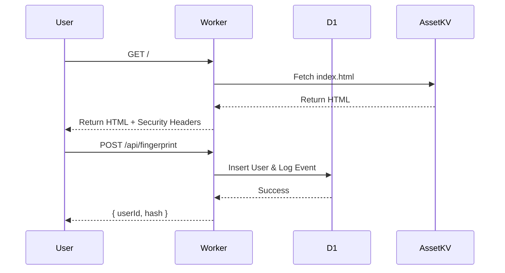

# System Architecture

## Overview
The system consists of a Cloudflare Worker serving a static frontend and handling API requests backed by a D1 SQL database. An SSH tunnel allows secure access to a local machine.

## Components

### Cloudflare Worker
- **Entry Point:** `src/index.ts`
- **Responsibilities:**
    - Serve static assets (HTML, CSS, JS).
    - Handle API endpoints (`/api/logs`, `/api/fingerprint`).
    - Enforce security headers.
    - Log events to D1.

### Database (D1)
- **Tables:**
    - `users`: Stores unique visitor fingerprints.
    - `logs`: Stores access logs and latency metrics.

### Frontend
- **Technology:** Vanilla TypeScript (compiled to ES2020), SASS.
- **Features:**
    - Canvas-based background animation.
    - Real-time log viewer.
    - Browser fingerprinting.

## Diagrams

### Request Flow

